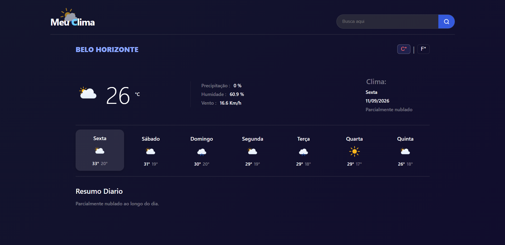
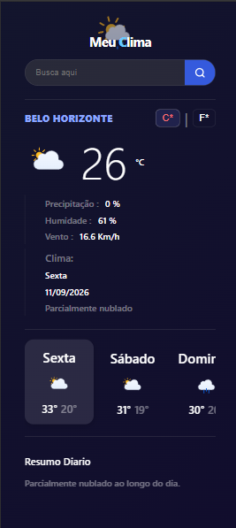

# 🌤️ Meu Clima App

<p align="center">
  
  
</p>

<p align="center">
  <b>Aplicação web responsiva para consulta de previsão do tempo em tempo real, desenvolvida com JavaScript assíncrono e empacotada com Webpack.</b>
</p>

---

## 🎯 Objetivos do Projeto

Este projeto foi desenvolvido como parte dos estudos de desenvolvimento Web (trilha *The Odin Project*), focando nos seguintes pilares fundamentais:

* **Programação Assíncrona & Consumo de APIs:** Prática com `async/await` e `fetch API` para requisição, tratamento de erros e renderização dinâmica dos dados meteorológicos.
* **Cuidado com Responsividade:** Planejamento dedicado para dispositivos móveis, garantindo um layout fluido, modal de busca adaptativo e uma seção de previsão semanal com navegação por rolagem horizontal nativa (`scroll-snap`).
* **Arquitetura Modular com Webpack:** Mapeamento e empacotamento de ativos (SVGs) via `require.context`, separação de responsabilidades (UI e API) em módulos ES6 e gerenciamento de build para produção.

---

## 🛠️ Tecnologias e Ferramentas

* **HTML5 & CSS3:** CSS Grid, Flexbox, variáveis CSS e Media Queries.
* **JavaScript (ES6+):** Programação assíncrona, Manipulação de DOM, Orientação a Objetos.
* **Webpack 5:** `webpack-cli`, `webpack-dev-server`, `html-webpack-plugin`, `style-loader` e `css-loader`.
* **Git & GitHub Pages:** Controle de versão e automação de deploy através do pacote `gh-pages`.

---

## 📱 Destaques de UX/UI e Responsividade

* **Carrossel Nativo para Mobile:** A seção de previsão de 7 dias utiliza `scroll-snap-type: x mandatory` e `scroll-snap-align: center`, permitindo que o usuário deslize pelos dias de forma fluida em telas menores.
* **Alternância de Unidades:** Suporte para conversão em tempo real de temperaturas de Celsius (°C) para Fahrenheit (°F).
* **Feedback Visual:** Modal interativo e estado de carregamento (*loader*) enquanto os dados da API são processados.

---

## 🚀 Como Executar o Projeto Localmente

### Pré-requisitos
* [Node.js](https://nodejs.org/) instalado na máquina.

---

### Passo a passo

**Clone o repositório:**

```bash
    git clone [https://github.com/thiagoSantz/Meu-Clima-App.git](https://github.com/thiagoSantz/Meu-Clima-App.git)
    cd Meu-Clima-App 
    npm install
    npm start
```

---

## 🔗 Link do Projeto Online

confira o projeto rodando ao vivo no GitHub Pages:
https://thiagosantz.github.io/Meu-Clima-App/

---
   
Desenvolvido por Thiago Santz como parte do currículo do The Odin Project 🌱